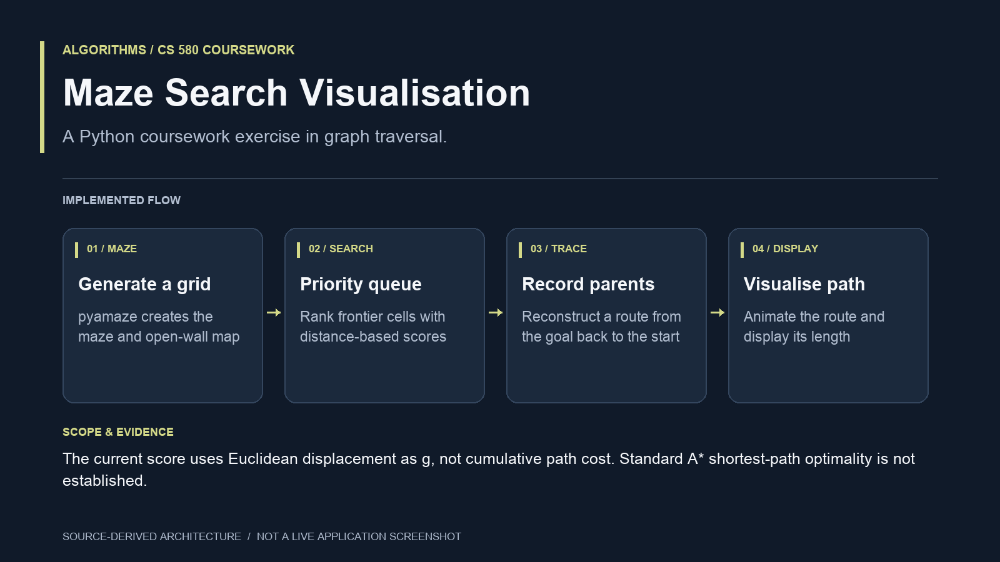

# Maze Search Visualisation — implementation guide

Created a CS 580 maze-search visualisation using Python, a priority queue and pyamaze. The implementation explores open neighbouring cells, records parents, reconstructs a route and displays the result. The current coursework scoring uses Euclidean displacement as g rather than accumulated path cost, so it should be presented as a search exercise without a standard A* optimality claim.

The graphic describes the checked-in implementation. It is an architecture diagram, not a screenshot, a benchmark result or evidence of a live production deployment.

## Source map

- **Generate a grid:** pyamaze creates the maze and open-wall map. See [h1_mshaik20.py](../h1_mshaik20.py).
- **Priority queue:** Rank frontier cells with distance-based scores. See [h1_mshaik20.py](../h1_mshaik20.py).
- **Record parents:** Reconstruct a route from the goal back to the start. See [h1_mshaik20.py](../h1_mshaik20.py).
- **Visualise path:** Animate the route and display its length. See [h1_mshaik20.py](../h1_mshaik20.py).

## Scope

The current score uses Euclidean displacement as g, not cumulative path cost. Standard A* shortest-path optimality is not established.

This presentation was checked against source revision `88c461a08e409420f8f7b6730d8da8fd59ced51a` on September 24, 2026. The documentation update does not claim a new application test run, cloud deployment or performance measurement.
